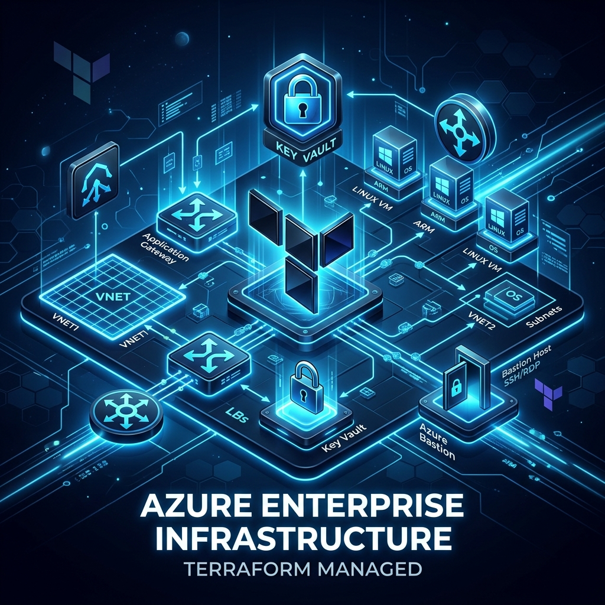
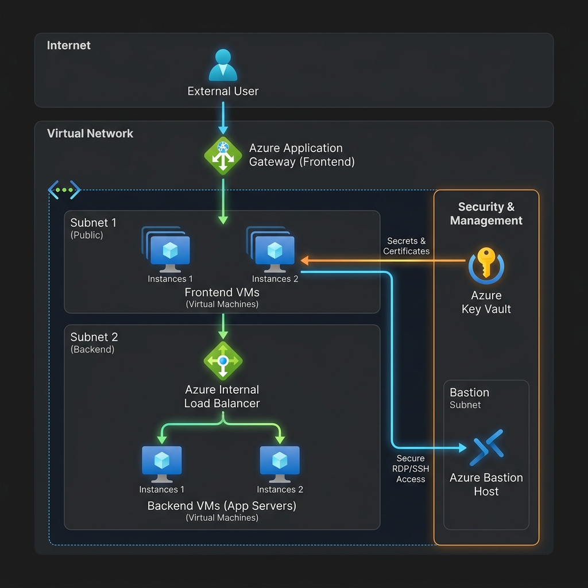
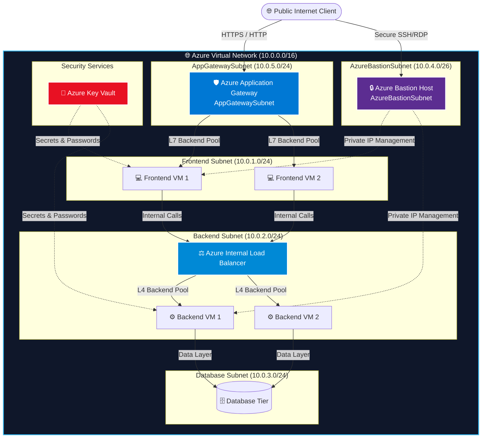

<div align="center">



# ☁️ Azure Enterprise Multi-Tier Infrastructure with Terraform

[](https://www.terraform.io/)
[](https://azure.microsoft.com/)
[](LICENSE)
[](environments/preprod)
[](environments/prod)
[](modules/azurerm_key_vault)

> **Enterprise-grade, modular, and security-first Infrastructure-as-Code (IaC) repository for provisioning automated 3-tier cloud infrastructure on Microsoft Azure.**

---

</div>

## 📑 Table of Contents

- [🌟 Overview & Architecture Highlights](#-overview--architecture-highlights)
- [🖼️ System Architecture & Network Topology](#️-system-architecture--network-topology)
- [📁 Project Structure](#-project-structure)
- [📦 Modular Infrastructure Components](#-modular-infrastructure-components)
- [🌍 Environments Matrix](#-environments-matrix)
- [⚡ Quick Start & Deployment Guide](#-quick-start--deployment-guide)
- [🔒 Security & Compliance Best Practices](#-security--compliance-best-practices)
- [⚙️ Maintenance & Operations](#️-maintenance--operations)
- [🤝 Contributing & Support](#-contributing--support)

---

## 🌟 Overview & Architecture Highlights

This repository contains a **production-ready**, highly modular Terraform codebase designed to provision scalable multi-tier application infrastructure on **Microsoft Azure**. Built following **Cloud Adoption Framework (CAF)** and **Azure Well-Architected Framework** guidelines, it enables predictable, repeatable, and isolated environment deployments.

### ✨ Key Features

- 🏢 **Multi-Tier Network Segmentation**: Dedicated subnets for Layer 7 Application Gateway, Frontend Web Servers, Backend Microservices, Database Layer, and Azure Bastion.
- 🔒 **Zero-Trust Security Architecture**:
  - Administrative access exclusively via **Azure Bastion** (No public SSH/RDP management ports).
  - VM administrator credentials dynamically retrieved from **Azure Key Vault** at runtime.
- ⚖️ **Dual Load Balancing Strategy**:
  - **Azure Application Gateway (L7)**: Web traffic routing, SSL termination, and frontend load balancing.
  - **Azure Internal Load Balancer (L4)**: High-throughput, low-latency traffic distribution to backend compute workloads.
- 🧩 **100% Reusable HCL Modules**: Dynamic HCL modules driven by `for_each` map iterations to eliminate code duplication.
- 🔄 **Multi-Environment State Isolation**: Separate Terraform remote backends stored in Azure Blob Storage with automated state locking for `preprod` and `prod`.

---

## 🖼️ System Architecture & Network Topology



### 🔀 Infrastructure Flow Diagram



---

## 📁 Project Structure

```text
infra/
├── 📄 .gitignore                              # Git ignore rules for Terraform states & local caches
├── 📄 README.md                               # Project documentation
├── 📁 assets/                                 # Architecture diagrams and visual assets
│   ├── 🖼️ architecture_banner.png
│   └── 🖼️ network_topology.png
├── 📁 environments/                           # Environment deployment configurations
│   ├── 📁 preprod/                            # Pre-Production Environment
│   │   ├── 📄 main.tf                         # Preprod module calls & pool associations
│   │   ├── 📄 provider.tf                     # Azure Provider & Blob Storage Backend configuration
│   │   ├── 📄 terraform.tfvars                # Preprod environment variable values
│   │   └── 📄 variables.tf                    # Variable declarations
│   └── 📁 prod/                               # Production Environment
│       ├── 📄 main.tf                         # Prod module calls & pool associations
│       ├── 📄 provider.tf                     # Production Blob Storage Backend configuration
│       ├── 📄 terraform.tfvars                # Production environment variable values
│       └── 📄 variables.tf                    # Variable declarations
└── 📁 modules/                                # Generic, reusable HCL infrastructure modules
    ├── 📁 azurerm_application_gateway/        # Layer 7 Application Gateway module
    ├── 📁 azurerm_bastion/                    # Azure Bastion Host module
    ├── 📁 azurerm_key_vault/                  # Azure Key Vault & Secrets management module
    ├── 📁 azurerm_load_balancer/              # Layer 4 Internal Load Balancer module
    ├── 📁 azurerm_public_ip/                  # Azure Public IP provisioning module
    ├── 📁 azurerm_resource_group/             # Resource Group management module
    ├── 📁 azurerm_subnet/                     # Subnet configuration module
    ├── 📁 azurerm_virtual_machine/            # Linux VM & NIC orchestration module
    └── 📁 azurerm_virtual_network/            # Virtual Network provisioning module
```

---

## 📦 Modular Infrastructure Components

Each infrastructure resource group is packaged into a standalone, reusable Terraform module within the [`modules/`](file:///c:/Terraform/infra/modules) directory.

| Icon | Module Name | Source Path | Description |
| :---: | :--- | :--- | :--- |
| 🏷️ | **Resource Group** | [`modules/azurerm_resource_group`](file:///c:/Terraform/infra/modules/azurerm_resource_group) | Provisions lifecycle-managed Azure Resource Groups across target regions. |
| 🌐 | **Virtual Network** | [`modules/azurerm_virtual_network`](file:///c:/Terraform/infra/modules/azurerm_virtual_network) | Configures primary VNet address spaces (`10.0.0.0/16`). |
| 🔀 | **Subnets** | [`modules/azurerm_subnet`](file:///c:/Terraform/infra/modules/azurerm_subnet) | Provisions segregated subnet ranges for Frontend, Backend, DB, Bastion, and AppGW. |
| 🌐 | **Public IP** | [`modules/azurerm_public_ip`](file:///c:/Terraform/infra/modules/azurerm_public_ip) | Allocates Static/Dynamic Public IPs for Bastion host and Application Gateway. |
| 🔑 | **Key Vault** | [`modules/azurerm_key_vault`](file:///c:/Terraform/infra/modules/azurerm_key_vault) | Manages secure vault instances, access policies, and VM admin credentials. |
| 💻 | **Virtual Machines** | [`modules/azurerm_virtual_machine`](file:///c:/Terraform/infra/modules/azurerm_virtual_machine) | Provisions Ubuntu Linux compute instances with attached NICs and OS disks. |
| 🔒 | **Bastion Host** | [`modules/azurerm_bastion`](file:///c:/Terraform/infra/modules/azurerm_bastion) | Deploys managed Azure Bastion service for secure, browser-based VM access. |
| 🛡️ | **Application Gateway** | [`modules/azurerm_application_gateway`](file:///c:/Terraform/infra/modules/azurerm_application_gateway) | Manages Layer-7 load balancing, frontend IP configurations, and HTTP listeners. |
| ⚖️ | **Load Balancer** | [`modules/azurerm_load_balancer`](file:///c:/Terraform/infra/modules/azurerm_load_balancer) | Configures Layer-4 internal load balancers with health probes and backend pools. |

---

## 🌍 Environments Matrix

The infrastructure supports distinct deployment stages located in [`environments/`](file:///c:/Terraform/infra/environments):

| Environment | State Key | Storage Account | Resource Group | Primary Purpose |
| :--- | :--- | :--- | :--- | :--- |
| 🟠 **Pre-Production** | `preprod.terraform.tfstate` | `stchorpreprod` | `sks01-dev` | Integration testing, staging workloads, and QA validation. |
| 🔴 **Production** | `prod.terraform.tfstate` | `stchorpreprod` | `sks01-dev` | High-availability production environment for enterprise workloads. |

> [!NOTE]
> Backend state management is configured in [`provider.tf`](file:///c:/Terraform/infra/environments/preprod/provider.tf) using Azure Blob Storage with automated blob locking to prevent concurrent state corruption.

---

## ⚡ Quick Start & Deployment Guide

### 📋 Prerequisites

Before running deployment commands, ensure you have the following tools installed and configured:

- 🛠️ **[Terraform CLI](https://developer.hashicorp.com/terraform/downloads)** `>= 1.5.0`
- 💻 **[Azure CLI](https://learn.microsoft.com/en-us/cli/azure/install-azure-cli)** `>= 2.50.0`
- 🔑 Active **Azure Subscription** with `Contributor` or `Owner` permissions.

### 🔑 Step 1: Azure Authentication

Log in to your Azure account and select the target subscription:

```bash
# Log in to Azure interactive shell
az login

# Set active subscription
az account set --subscription "YOUR_AZURE_SUBSCRIPTION_ID"
```

### 🛠️ Step 2: Initialize & Deploy Environment

Navigate to the desired environment directory (e.g., `preprod`):

```bash
# Change directory to target environment
cd environments/preprod

# Initialize Terraform workspace & download providers
terraform init

# Validate HCL syntax and module references
terraform validate

# Generate and review execution plan
terraform plan -out=tfplan.binary

# Apply infrastructure changes
terraform apply tfplan.binary
```

> [!IMPORTANT]
> Ensure Key Vault secrets (e.g., `admin-password`) exist in Azure Key Vault before running `terraform apply`, as VM provisioning performs a data source lookup for initial admin credentials.

---

## 🔒 Security & Compliance Best Practices

> [!TIP]
> This infrastructure complies with Azure Security Benchmark v3 standards:

1. **No Hardcoded Passwords**: All VM administrative credentials are read directly from Azure Key Vault data sources at apply time.
2. **Network Isolation**:
   - Database subnets are closed to external internet routes.
   - Microservices communicate internally over private VNet IPs (`10.0.0.0/16`).
3. **Zero Management Public IPs**: Linux VMs do not possess public IP addresses. Administrative management is performed strictly over encrypted SSH sessions via **Azure Bastion**.
4. **State Storage Encryption**: Remote `.tfstate` files are encrypted at rest using AES-256 in Azure Blob Storage.

---

## ⚙️ Maintenance & Operations

### 🧹 Infrastructure Destruction

To tear down an environment safely:

```bash
cd environments/preprod
terraform plan -destroy -out=destroy.tfplan
terraform apply destroy.tfplan
```

### 🔍 Drift Detection & Plan Inspection

To check for drift between real-world Azure resources and Terraform state:

```bash
terraform plan -detailed-exitcode
```

---

## 🤝 Contributing & Support

Contributions, issues, and feature requests are welcome!

1. Fork the repository 🍴
2. Create your feature branch (`git checkout -b feature/AmazingFeature`)
3. Commit your changes (`git commit -m 'Add some AmazingFeature'`)
4. Push to the branch (`git push origin feature/AmazingFeature`)
5. Open a Pull Request 🔀

---

<div align="center">

Made with ❤️ & Terraform by **[Sourabh Kumar](https://github.com/iam-sourabhkumar)**

</div>